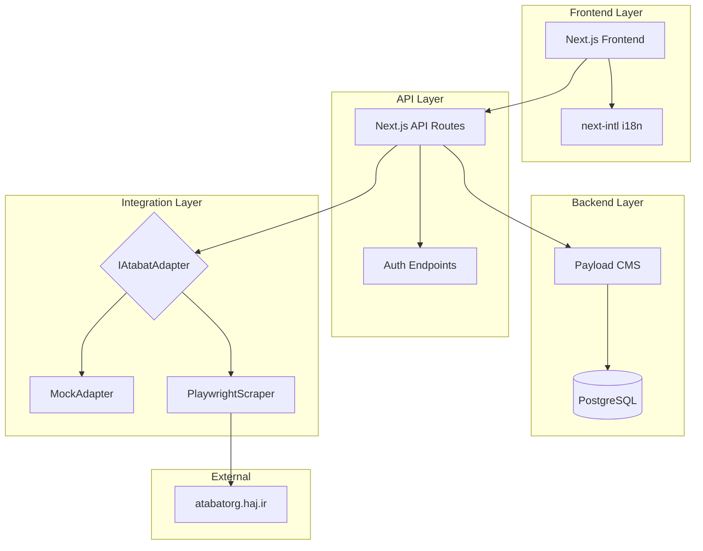
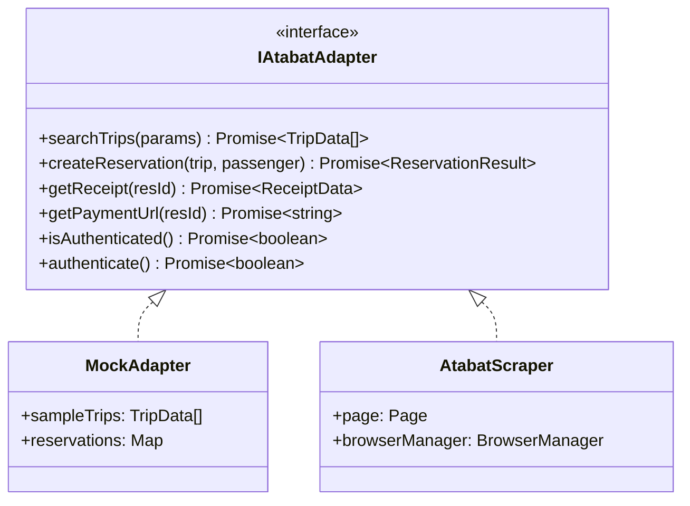
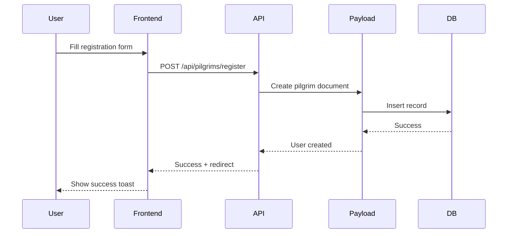
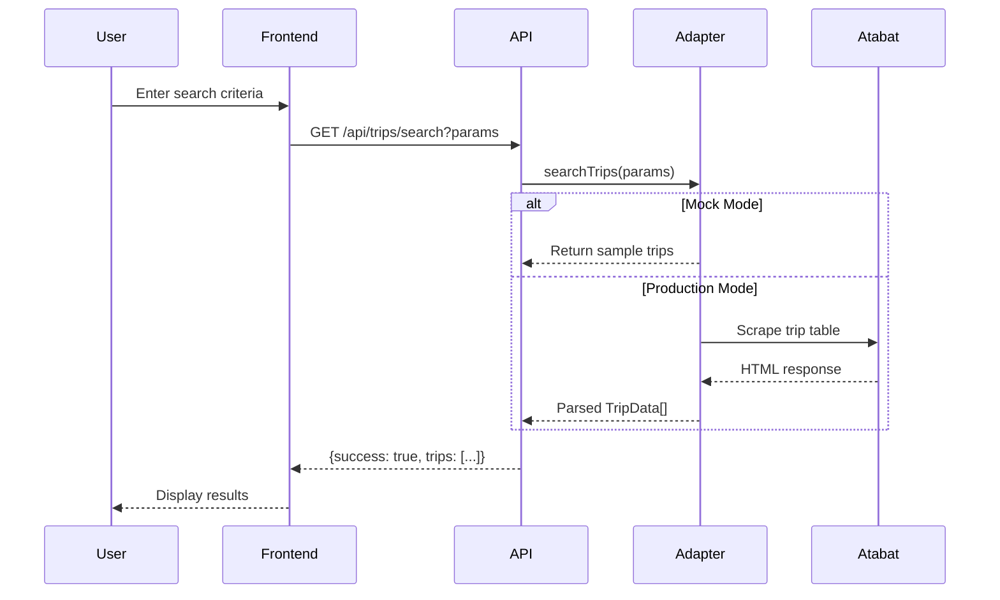

# In the Name of God, the Creative, the Originator

# Atabat Management App - Architecture Documentation

## Overview

The Atabat Management App is a modern web application that provides a streamlined interface for booking pilgrimage trips to Iraq. It replaces a legacy ASP.NET WebForms application with a modern Next.js + Payload CMS stack, while maintaining integration with the original Atabat system through a Playwright-based scraping engine.



---

## System Components

### 1. Frontend (Next.js App Router)

**Location:** `src/app/(frontend)/`

The frontend uses Next.js 15 with the App Router, providing:

- **Server Components** for SEO and performance
- **Client Components** for interactivity (marked with `'use client'`)
- **Internationalization** via `next-intl` supporting Persian (RTL) and English
- **Modern UI** with CSS Modules and responsive design

#### Key Pages

| Route                     | Component       | Description                       |
| ------------------------- | --------------- | --------------------------------- |
| `/[locale]`               | Home page       | Landing with quick actions        |
| `/[locale]/trips`         | Trips search    | Search and browse available trips |
| `/[locale]/reservations`  | My reservations | View/manage bookings              |
| `/[locale]/auth/login`    | Login           | User authentication               |
| `/[locale]/auth/register` | Register        | New user registration             |

### 2. API Layer

**Location:** `src/app/(frontend)/api/`

RESTful API endpoints built with Next.js Route Handlers:

| Endpoint                 | Method | Description            |
| ------------------------ | ------ | ---------------------- |
| `/api/pilgrims/register` | POST   | Register new pilgrim   |
| `/api/pilgrims/login`    | POST   | Authenticate pilgrim   |
| `/api/auth/me`           | GET    | Get current user       |
| `/api/auth/logout`       | POST   | Clear auth session     |
| `/api/trips/search`      | GET    | Search available trips |

### 3. Payload CMS

**Location:** `src/payload.config.ts`

Payload CMS provides:

- **Admin Panel** at `/admin` for system management
- **Database Integration** with PostgreSQL
- **Authentication** for both admin users and pilgrims
- **REST & GraphQL APIs** auto-generated from collections

#### Collections

| Collection     | Description                   |
| -------------- | ----------------------------- |
| `users`        | Admin/system users            |
| `pilgrims`     | End-user accounts (travelers) |
| `trips`        | Cached trip data              |
| `reservations` | Booking records               |

#### Globals

| Global            | Description                       |
| ----------------- | --------------------------------- |
| `kargozar-config` | Atabat credentials & session data |

### 4. Scraper/Adapter Pattern

**Location:** `src/scraper/`

The integration layer uses an **Adapter Pattern** to abstract the data source:



#### Adapter Selection

- **Development/Testing:** `MockAdapter` provides realistic test data
- **Production:** `AtabatScraper` uses Playwright to interact with the legacy site

Environment variable: `USE_MOCK_SCRAPER=true` enables mock mode.

---

## Data Flow

### User Registration Flow



### Trip Search Flow



---

## File Structure

```
src/
├── app/
│   ├── (frontend)/           # Public-facing app
│   │   ├── [locale]/         # i18n routes
│   │   │   ├── auth/         # Login/Register
│   │   │   ├── trips/        # Trip search
│   │   │   └── reservations/ # User reservations
│   │   └── api/              # API routes
│   └── (payload)/            # Admin panel (auto-generated)
├── collections/              # Payload collections
├── components/
│   └── ui/                   # Reusable UI components
├── globals/                  # Payload globals
├── hooks/                    # React hooks (useAuth, etc.)
├── i18n/                     # Internationalization config
├── scraper/                  # Adapter pattern implementation
├── utils/                    # Utility functions
└── validations/              # Zod schemas
```

---

## Key Technologies

| Technology                  | Purpose                         |
| --------------------------- | ------------------------------- |
| **Next.js 15**              | React framework with App Router |
| **Payload CMS 3**           | Headless CMS & auth             |
| **PostgreSQL**              | Primary database                |
| **Playwright**              | Browser automation for scraping |
| **next-intl**               | Internationalization (FA/EN)    |
| **react-hot-toast**         | Toast notifications             |
| **react-multi-date-picker** | Jalali calendar support         |
| **Zod**                     | Schema validation               |

---

## Environment Configuration

| Variable           | Description                     |
| ------------------ | ------------------------------- |
| `DATABASE_URI`     | PostgreSQL connection string    |
| `PAYLOAD_SECRET`   | Payload encryption secret       |
| `USE_MOCK_SCRAPER` | Enable mock adapter for testing |

---

## Security Considerations

1. **Authentication:** HTTP-only cookies for session tokens
2. **Validation:** Server-side Zod validation on all inputs
3. **CSRF:** Built-in Next.js CSRF protection
4. **Secrets:** Environment variables for sensitive data
5. **Scraper Isolation:** Browser context isolation per session

---

## Deployment

The app is containerized with Docker:

- `Dockerfile` - Multi-stage Node.js build
- `docker-compose.yml` - App + PostgreSQL setup

**Production Considerations:**

- Playwright requires browser binaries (Chromium)
- Use persistent storage for cookie/session data
- Configure proper CORS for API endpoints
