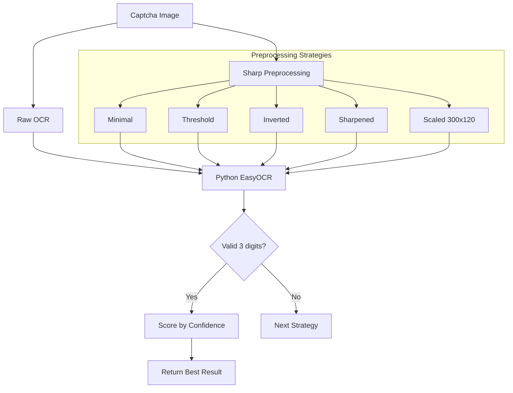

# Captcha OCR Pipeline

> In the Name of God, the Creative, the Originator

This document describes the captcha OCR solution for Persian/Arabic 3-digit captchas used by the Atabat site.

## Overview

The pipeline uses:

- **EasyOCR** (Python) for text recognition
- **Sharp** (Node.js) for image preprocessing
- **Multi-strategy voting** for reliable results

## Architecture



## Components

### 1. Python EasyOCR Script

**Location**: `scripts/ocr_captcha.py`

The script accepts an image path and returns JSON with recognized text and confidence:

```json
{
  "text": "649",
  "raw": "٦٤٩",
  "confidence": 0.98
}
```

**Usage**:

```bash
python scripts/ocr_captcha.py path/to/captcha.png
```

### 2. Captcha Module

**Location**: `src/scraper/captcha.ts`

Key exported functions:

| Function                                     | Description                                |
| -------------------------------------------- | ------------------------------------------ |
| `solveCaptcha(page, selector)`               | Solve captcha from Playwright page element |
| `solveCaptchaFromFile(imagePath)`            | Solve captcha from image file              |
| `preprocessCaptcha(input, output, strategy)` | Apply preprocessing strategy               |
| `refreshCaptcha(page, selector)`             | Click captcha to refresh                   |
| `cleanupOCR()`                               | Cleanup resources (no-op for Python impl)  |

### 3. Preprocessing Strategies

| Strategy    | Description           | Best For          |
| ----------- | --------------------- | ----------------- |
| `minimal`   | Grayscale + normalize | Clean captchas    |
| `threshold` | Binarization at 140   | High contrast     |
| `inverted`  | Negative image        | Dark backgrounds  |
| `sharpened` | Edge enhancement      | Blurry text       |
| `scaled`    | 300x120 upscale       | Small captchas ✨ |

## How It Works

1. **Raw OCR**: First tries OCR on the original image
2. **Preprocessing**: If raw fails or for comparison, applies each preprocessing strategy
3. **Validation**: Filters results to valid 3-digit strings
4. **Selection**: Returns the result with highest confidence score

## Integration with Auth

The `auth.ts` scraper uses the captcha module during login:

```typescript
import { solveCaptcha, refreshCaptcha, cleanupOCR } from './captcha';

// During login form handling
const captchaText = await solveCaptcha(page, '#captcha_image');
await page.fill('#captcha_response_field', captchaText);

// If captcha fails, refresh and retry
await refreshCaptcha(page, '#captcha_image');
```

## Testing

### Run Captcha Test

```bash
pnpm tsx tests/captcha.test.ts
```

### Sample Test Output

```
============================================================
Captcha OCR Pipeline Test
============================================================

Found 5 captcha files to test

Testing: 245.png
  Expected: 245
[Captcha] Raw (no preprocess): "٢٤٥" -> "245" (conf: 0.62)
[Captcha] Strategy "scaled": "245" (conf: 0.95, valid: true)
[Captcha] Best result: "245" from "scaled" (conf: 0.95)
  Recognized: 245
  Result: ✓ PASS

...

Results: 5/5 passed (100.0% accuracy)
```

## Dependencies

### Python

- Python 3.x
- `easyocr` package

Install with:

```bash
pip install easyocr
```

### Node.js

- `sharp` (already in package.json)

## Performance Notes

- First EasyOCR call is slow (~10-20s) due to model loading
- Subsequent calls are faster (~1-3s each)
- Multi-strategy approach adds overhead but improves accuracy
- For production, consider caching the EasyOCR reader instance

## Troubleshooting

### Common Issues

1. **Python not found**: Ensure `python` is in PATH
2. **EasyOCR not installed**: Run `pip install easyocr`
3. **Model download fails**: Check internet connection; models are ~100MB
4. **Low accuracy**: Try adjusting preprocessing threshold values

### Debug Mode

Set environment variable to keep preprocessed images:

```bash
DEBUG_CAPTCHA=1 pnpm tsx tests/captcha.test.ts
```
